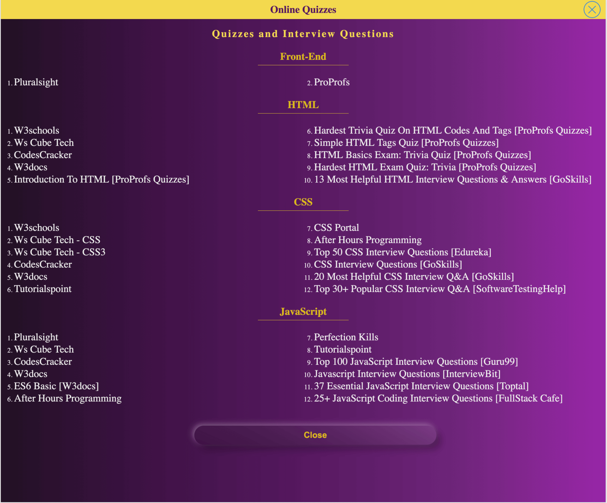

# FEND-resources

### 
شرح محتوى الموقع

<ul>
  <li>يقدم الموقع مصادر لأشهر المواقع باللغة العربية واللغة الانجليزيه في مجال إنشاء واجهة المواقع الالكترونية </li>
  <li> يحتوي الجزء الاول على اشهر القنوات التعليمية على اليوتيوب</li>
  <li> الجزء الثاني يشمل اللغات الاساسية لإنشاء واجهة موقع الكتروني</li>
  <li> الجزء الثالث يشمل أربع اقسام للقراءه و التدريب وحل الاختبارات بالاضافه الى ورقة إختصارات الاكواد للغات الاساسية</li>
  <li>الجزءالرابع خاص بإنشاء مشاريع للتدريب</li>
  <li>أماالجزءالاخير فهو يحتوى على المواقع المساعده للتصميم مثل مواقع الايكونات او الصور او الالوان ..الخ، او مواقع مساعده في الانشاء مثل مواقع مراجعة الكود او ضغط الصور..الخ</li>
  <li>يمكنك تثبيت صفحة الموقع من خلال خاصية Add to home screen</li>
</ul>

### Go To Live Page https://walaaayyad.github.io/FEND-resources/

##  *** The Content Of The Website ***
### ** Educational Channels on Youtube **
#### Arabic Channels
- Elzero Web School https://www.youtube.com/c/ElzeroInfo/playlists
- Unique Coderz Academy https://www.youtube.com/c/UniqueCoderzAcademy/playlists
- Nour Homsi https://www.youtube.com/c/NourHomsi/playlists
- SemiColon Academy https://www.youtube.com/c/SemiColonAcademy/playlists
- Mohamed Abusrea https://www.youtube.com/c/MohamedAbusrea/playlists
- Free4arab https://www.youtube.com/user/Nourelhoda2011/playlists
- Codezilla https://www.youtube.com/c/Codezilla/playlists
- Codehood https://www.youtube.com/c/Codehood/playlists
- CodeZone https://www.youtube.com/c/codeZone/playlists
- Arabic HTML https://www.youtube.com/c/Arabic-html/playlists
- Angular Army https://www.youtube.com/c/AngularArmy/playlists
- Freelance Monsters https://www.youtube.com/channel/UCirZap8QRlZIZ6LdHQoLaxg/videos
- Freelance Monsters website https://freelancemonsters.com/
- Abdelrahman Haridy https://www.youtube.com/channel/UCB9oU-M1rmHH6YQ-38CkzOw/playlists
#### Arabic Podcast 
- null++ https://nullplus.plus/
- Teck and Coffee https://anchor.fm/iahmadzain
#### English Channels
- The Net Ninja https://www.youtube.com/c/TheNetNinja/playlists
- Traversy Media https://www.youtube.com/c/TraversyMedia/playlists
- Academind https://www.youtube.com/c/Academind/playlists
- Google Chrome Developers https://www.youtube.com/c/GoogleChromeDevelopers/playlists
- Online Tutorials https://www.youtube.com/c/OnlineTutorials4Designers/playlists
- Coding Addict https://www.youtube.com/c/CodingAddict/playlists
- Dev Ed https://www.youtube.com/c/DevEd/playlists
- Going-To Internet https://www.youtube.com/c/GoingToInternet/playlists
- The Coding Train https://www.youtube.com/c/TheCodingTrain/playlists
- The WebShala https://www.youtube.com/channel/UC94lpQZvaokkIqU-TvtsGXQ/playlists
- LearnWebCode https://www.youtube.com/user/LearnWebCode/playlists
- Programming with Mosh https://www.youtube.com/c/programmingwithmosh/playlists
- Udemy Tech https://www.youtube.com/c/UdemyTech/playlists
- DevTips https://www.youtube.com/c/DevTipsForDesigners/playlists

### ** Read **
#### FrontEnd
- Front-end Developer Guide https://frontendmasters.com/books/front-end-handbook/2019/
- Programming books https://books.goalkicker.com/
#### HTML
- w3schools https://www.w3schools.com/html/
- MDN Web Docs https://developer.mozilla.org/en-US/docs/Web/HTML
- MDN Web Docs [ Arabic ]  https://developer.mozilla.org/ar/docs/Web/HTML
- المكتبة التقنية https://download-internet-pdf-ebooks.com/27-1-library-books
#### CSS
- CSS-Tricks https://css-tricks.com/
- W3schools https://www.w3schools.com/css/
- MDN Web Docs https://developer.mozilla.org/en-US/docs/Web/CSS
- المكتبة التقنية https://download-internet-pdf-ebooks.com/32-1-library-books
- Apress Books - CSS [Free for Egyptions] https://www.apress.com/gp/web-development/css
#### JavaScript
- MDN Web Docs https://developer.mozilla.org/en-US/docs/Web/JavaScript/Guide
- MDN Web Docs [ Arabic ] https://developer.mozilla.org/ar/docs/Web/JavaScript/Guide
- The Modern JavaScript Tutorial https://javascript.info/
- w3schools https://www.w3schools.com/js/DEFAULT.asp
- Tutorials Point https://www.tutorialspoint.com/javascript/index.htm
- You-Dont-Know-JS https://github.com/getify/You-Dont-Know-JS
- رفوف https://www.rofofs.com/2019/07/Learn-Javascript-pdf-free.html
- المكتبة التقنية https://download-internet-pdf-ebooks.com/29-1-library-books
- Apress Books-JavaScript [Free for Egyptions] https://www.apress.com/gp/web-development/javascript

### ** Practice **
#### FrontEnd
- Frontend Mentor https://www.frontendmentor.io/
#### JavaScript
- freeCodeCamp https://www.freecodecamp.org/learn/javascript-algorithms-and-data-structures/basic-javascript/
- Javascript30 https://javascript30.com/
- Edabit Challenges https://edabit.com/challenges
- 10 Days of Javascript [ HackerRank ] https://www.hackerrank.com/domains/tutorials/10-days-of-javascript
- Learn js https://www.learn-js.org/
- Exercises,Practice,Solution [ w3resource ] https://www.w3resource.com/javascript-exercises/
- Algorithms [ freeCodeCamp ] https://www.freecodecamp.org/learn/javascript-algorithms-and-data-structures/
#### CSS
- Responsive Web Design [ freeCodeCamp ] https://www.freecodecamp.org/learn/responsive-web-design/
- Challenges [ codier ] https://codier.io/

### ** Cheat Sheet **
#### HTML
- HTML Element Reference https://www.w3schools.com/TAGS/default.ASP
- The Ultimate HTML5 Cheat Sheet–2021 https://www.wpkube.com/html5-cheat-sheet/
- Digital HTML Cheatsheet https://digital.com/tools/html-cheatsheet/
#### CSS
- CSS Reference https://www.w3schools.com/cssref/default.asp
- Toptal CSS cheat sheet https://www.toptal.com/css/css-cheat-sheet
- CSS Cheat Sheet https://adam-marsden.co.uk/css-cheat-sheet
#### JavaScript
- JavaScript and HTML DOM Reference https://www.w3schools.com/jsref/default.asp
- Cheatography https://cheatography.com/davechild/cheat-sheets/javascript/
- XUL JavaScript Cheat Sheet https://www.xul.fr/javascript/cheat-sheet.php
- JavaScript Array Cheat Sheet https://andreasnylin.com/js-array-cheat-sheet/
- OneDrive javaScript https://onedrive.live.com/?authkey=%21AB9haHgwXtaDCK0&cid=5E4F6DAE2F8B84DE&id=5E4F6DAE2F8B84DE%21122414&parId=5E4F6DAE2F8B84DE%21103814&o=OneUp

### ** Quizzes and Interview Questions **
#### FrontEnd
- Pluralsight https://www.pluralsight.com/paths/building-websites-with-html-css-and-javascript
- ProProfs https://www.proprofs.com/quiz-school/story.php?title=how-good-are-you-at-geometry_481gd
#### HTML
- W3schools https://www.w3schools.com/html/html_quiz.asp
- Ws Cube Tech https://www.wscubetech.com/quiz-test-html
- CodesCracker https://codescracker.com/exam/showtest.php?subid=4
- W3docs https://www.w3docs.com/quiz-start/html-basic
- Introduction To HTML [ProProfs Quizzes] https://www.proprofs.com/quiz-school/story.php?title=html-coding-quiz-1
- Hardest Trivia Quiz On HTML Codes And Tags [ProProfs Quizzes] https://www.proprofs.com/quiz-school/story.php?title=html-postassessment
- Simple HTML Tags Quiz [ProProfs Quizzes] https://www.proprofs.com/quiz-school/story.php?title=simple-html-tags-quiz
- HTML Basics Exam: Trivia Quiz [ProProfs Quizzes] https://www.proprofs.com/quiz-school/story.php?title=introduction-to-html_2
- Hardest HTML Exam Quiz: Trivia [ProProfs Quizzes] https://www.proprofs.com/quiz-school/story.php?title=html_146
- 13 Most Helpful HTML Interview Questions & Answers [ GoSkills ] https://www.goskills.com/Development/Resources/HTML-interview-questions-answers
#### CSS
- W3schools https://www.w3schools.com/css/css_quiz.asp
- Ws Cube Tech-CSS https://www.wscubetech.com/quiz-test-css
- Ws Cube Tech-CSS3 https://www.wscubetech.com/quiz-test-css3
- CodesCracker https://codescracker.com/exam/showtest.php?subid=5
- W3docs https://www.w3docs.com/quiz-start/css-basic
- Tutorialspoint https://www.tutorialspoint.com/css/css_online_test.htm
- CSS Portal https://www.cssportal.com/css-quiz/
- After Hours Programming https://www.afterhoursprogramming.com/tutorial/css/css-quiz/
- Top 50 CSS Interview Questions [ Edureka ]  https://www.edureka.co/blog/interview-questions/css-interview-questions/
- CSS Interview Questions [ GoSkills ] https://www.javatpoint.com/css-interview-questions
- 20 Most Helpful CSS Interview Q&A [ GoSkills ] https://www.goskills.com/Development/Resources/CSS-interview-questions-answers
- Top 30+ Popular CSS Interview Q&A [ SoftwareTestingHelp ] https://www.softwaretestinghelp.com/css-interview-questions/
#### JavaScript
- Pluralsight https://www.pluralsight.com/paths/javascript-core-language
- Ws Cube Tech https://www.wscubetech.com/quiz-test-javascript
- CodesCracker https://codescracker.com/exam/showtest.php?subid=6
- W3docs https://www.w3docs.com/quiz-start/javascript-basic
- ES6 Basic [ W3docs ] https://www.w3docs.com/quiz-start/es6-basic
- After Hours Programming  https://www.afterhoursprogramming.com/tutorial/javascript/javascript-quiz/
- Perfection Kills http://perfectionkills.com/javascript-quiz-es6/
- Tutorialspoint https://www.tutorialspoint.com/javascript/javascript_online_quiz.htm
- Top 100 JavaScript Interview Questions [ Guru99 ] https://www.guru99.com/javascript-interview-questions-answers.html
- Javascript Interview Questions [ InterviewBit ] https://www.interviewbit.com/javascript-interview-questions/
- 37 Essential JavaScript Interview Questions [ Toptal ] https://www.toptal.com/javascript/interview-questions
- 25+ JavaScript Coding Interview Questions [FullStack Cafe] https://www.fullstack.cafe/blog/javascript-code-interview-questions

### ** Projects **
#### Arabic Projects
- 1- HTML And CSS Template 1 https://www.youtube.com/watch?v=MBq8ZFEIIaQ&list=PLDoPjvoNmBAzHSjcR-HnW9tnxyuye8KbF
- 2- Create Template With HTML,CSS3,JavaScript https://www.youtube.com/watch?v=vedT2jk3hi4&list=PLDoPjvoNmBAzvmpzF-6l3tAviiCPbwkB8&index=1
- 3- Creating A Website From Preview [ Html, Css Lv1 ] https://www.youtube.com/watch?v=urQihL3GTnw&list=PLDoPjvoNmBAxzmjuEpKP8r4sVWEtFvKoq&index=1
- 4- Creating A Website From Preview [ Html, Css, jQuery Lv2 ] https://www.youtube.com/watch?v=52s6c4kYx-Y&list=PLDoPjvoNmBAwccMO4JiLP_vJHxJ_NWeqL
- 5- Creating A Website From Preview [ Html, Css3, jQuery Lv3 ] https://www.youtube.com/watch?v=6olupGFs9DA&list=PLDoPjvoNmBAzVWN837CWYXS18LJ69HvRV
- 6- Design Using Bootstrap 3 Design 1 https://www.youtube.com/watch?v=auFVttzUoo8&list=PLDoPjvoNmBAw24EjNUp_88S1VeaNK8Cts
- 7- Design Using Bootstrap 3 Design 2 https://www.youtube.com/watch?v=SwCQTLB2zoo&list=PLDoPjvoNmBAxYmbhnyM0yxH3OzhoDiAP9
- 8- Design Using Bootstrap 4 Design 1 https://www.youtube.com/watch?v=DbUjq8J6RK8&list=PLDoPjvoNmBAy0dU3C3_lNRTSTtqePEsI2
- 9- Design Responsive Template Using ( HTML,CSS,Media Query ) https://www.youtube.com/watch?v=s599ucSnBs8&list=PLtFbQRDJ11kG7W2TmVs4gr9FqmZ0Ui551
- 10- Design Template Using ( HTML5 - CSS3 ) https://www.youtube.com/watch?v=1anI07Bde6g&list=PLtFbQRDJ11kFq3C3I7sKHjXbFru4rx8qs
- 11- Design Template Using ( HTML5 , CSS3 , Bootstrap) https://www.youtube.com/watch?v=FV1JUHo3mA0&list=PLtFbQRDJ11kHL5MyN6kLTr1n4InvKdeis
- 12- Design Template Using ( HTML , CSS , jQuery ) https://www.youtube.com/watch?v=MGiqZbnt1n4&list=PLtFbQRDJ11kE3Weby1aZ0wKcgBk_iIlq3
- 13- Design Template Multiple Pages Using ( HTML & CSS) https://www.youtube.com/watch?v=hIhpIUPFDhM&list=PLtFbQRDJ11kEvT0fwrz003tAGZP7sIBhI
- 14- Design Template Using ( HTML5 - CSS3 - jQuery ) https://www.youtube.com/watch?v=0WL7hR__mw8&list=PLtFbQRDJ11kFg64KOH91XV7JkueV3rUvu
- 15- Design Template Using ( HTML - CSS - JS ) https://www.youtube.com/watch?v=h9MyENykDLk&list=PLtFbQRDJ11kHihgJYV_6S3j7KhK96cdB1
- 16- Design Template Using ( HTML - CSS ) https://www.youtube.com/watch?v=iE1o-VtwfFw&list=PLtFbQRDJ11kHtc8yjnmdxdoebNMumtlzH
- 17- مشاريع صغيرة - HTML, CSS, Javascript https://www.youtube.com/watch?v=IC2XLhYxTOQ&list=PL0_C_32YKLpwetRB-a3Rj0Q4KNuIVocao
- 18- SPA with JavaScript https://www.youtube.com/watch?v=ET5xqznLP7E&list=PLtxOBbrOOPH6Os1EJifSE59Bd5WbL15pn
#### English Projects
- 1- Build A Responsive HTML & CSS Template With FlexboxGrid https://www.youtube.com/watch?v=qlA7dputiNc&list=PLillGF-RfqbZTASqIqdvm1R5mLrQq79CU&index=39
- 2- 15 Vanilla Javascript Projects https://www.youtube.com/watch?v=c5SIG7Ie0dM&list=PLnHJACx3NwAdT_8forzXYvx0o4A2VnoHX&index=3
- 3- Projects https://www.youtube.com/watch?v=n_anTrNkRCQ&list=PLnHJACx3NwAd9rkfjamhmUs8iO38CgYXR&ab_channel=CodingAddict
- 4- Mobile-First Responsive Build (with CSS Grid) https://www.youtube.com/watch?v=PM3XW_1RAIs&list=PL4cUxeGkcC9hH1tAjyUPZPjbj-7s200a4
- 5- HTML AND CSS Project - Slider https://www.youtube.com/watch?v=1I19G1jSkvw&list=PLnHJACx3NwAePj6M2FCEn7m1vaO84imNA&ab_channel=CodingAddict
- 6- Javascript and Jquery Projects https://www.youtube.com/watch?v=aVLl1Lhvxo0&list=PLnHJACx3NwAf5ZJMIa-fNLKHS7MXtbJ1K&ab_channel=CodingAddict
- 7- Responsive Websites https://www.youtube.com/watch?v=cUzHoVsNWgU&list=PLnHJACx3NwAc1EOWalM2fyUQgdqlO9s3T&ab_channel=CodingAddict

### ** Developer Tools **
#### Testing, Optimization & Development
- HTML Validator by W3C https://validator.w3.org/
- CSS Validator by W3C https://jigsaw.w3.org/css-validator/
- Online Image Optimizer https://imagecompressor.com/
- Tiny jpg https://tinyjpg.com/
- Autoprefixer CSS online https://autoprefixer.github.io/
#### Popular Blogs & Communities
- Stack Overflow https://stackoverflow.com/
- smashing Magazine https://www.smashingmagazine.com/
- Front-End Front https://frontendfront.com/
- DEV Community https://dev.to/
#### Desigen Inspiration
- Web Design Inspiration https://www.webdesign-inspiration.com/
- The Best Designs https://www.thebestdesigns.com/
- Pinterest https://www.pinterest.com/search/pins/?q=website%20design%20inspiration&rs/
- One Page Love https://onepagelove.com/
- Dribble https://dribbble.com/
#### Color
- Adobe Color Wheel https://color.adobe.com/create/color-wheel
- Color Hunt Palettes https://colorhunt.co/
- Paletton https://paletton.com/#uid=14H0u0kllllaFw0g0qFqFg0w0aF
- Gradient CSS Generator https://html-css-js.com/css/generator/gradient/
- UI Gradients https://uigradients.com/#SandtoBlue
- ColorSpace CSS Gradients https://mycolor.space/gradient?ori=to+right+bottom&hex=%238E2DE2&hex2=%234A00E0&sub=1
#### Icons
- Vector Icons https://www.flaticon.com/
- PNG Tree https://pngtree.com/so/icon
- Font Awesome https://fontawesome.com/
- Icon Monstr https://iconmonstr.com/
- Ionicons https://ionicons.com/
- Flaticon https://www.flaticon.com/
#### Image
- Unsplash Images https://unsplash.com/
- Pixabay Images https://pixabay.com/
- Canva https://www.canva.com/
- Freepik https://www.freepik.com/
#### Font
- Google Fonts https://fonts.google.com/
- The best free fonts for designers https://www.creativebloq.com/graphic-design-tips/best-free-fonts-for-designers-1233380
- Shapes Font https://www.freebestfonts.com/shapes-free-fonts
#### Border
- Fancy Border Generator https://9elements.github.io/fancy-border-radius/#66.65.30.92--541.541
- Border Shape Generator https://bennettfeely.com/clippy/
- Get Waves https://getwaves.io/
#### Animation
- Animate.css https://animate.style/

